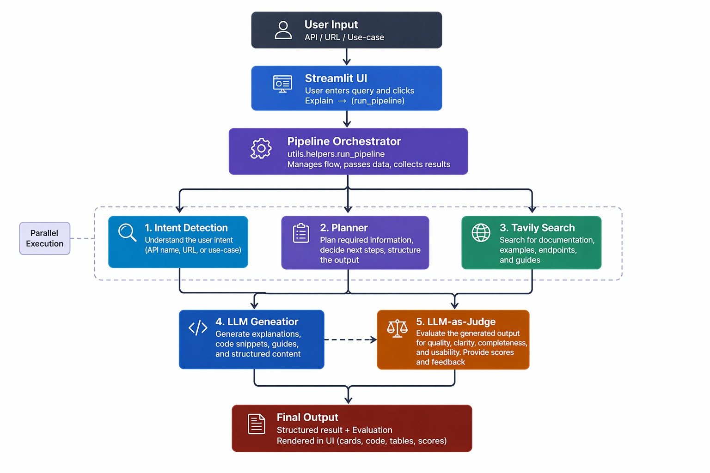

# API Documentation Explainer Agent

> An agentic AI web app that understands, explains, and evaluates any API in under 5 minutes.

[](https://apidocexplainer.streamlit.app/)
[](https://www.loom.com/share/9ebf2acbc857489373a8cc8a1d1280a)

---

## 📌 Overview

The **API Documentation Explainer Agent** is a production-grade agentic system that:

- **Explains** any API (by URL, name, or use-case) with deep technical detail.
- **Compares** multiple APIs side-by-side with contrastive analysis.
- **Generates** ready-to-use code examples in Python, JavaScript, and cURL.
- **Recommends** the best APIs for specific problems.
- **Evaluates** its own output quality using an **LLM-as-Judge**.

---

## 🏗️ Architecture

The system uses a **Multi-Provider Load Balancing** architecture to ensure maximum speed and reliability:



```
User Input
    │
    ▼
Intent Agent (Groq)    ← ultra-fast classification
    │
    ▼
Planner Agent (Groq)   ← builds execution steps
    │
    ▼
Tool Agent (Tavily)    ← fetches live data via Web Search
    │
    ▼
Generator Agent (Gemini) ← high-context JSON generation (w/ Multi-Key Rotation)
    │
    ▼
Judge Agent (Groq)     ← critical evaluation & scoring
    │
    ▼
Streamlit UI           ← Premium CSS, Crimson Pro typography, Custom HTML Cards
```

---

## ⚙️ Setup

### 1. Clone the repo

```bash
git clone https://github.com/your-username/api-doc-explainer.git
cd api-doc-explainer
```

### 2. Configure environment

Create a `.env` file and fill in your keys:

```
LLM_PROVIDER=groq
GROQ_API_KEY=your_key_here
GEMINI_API_KEYS=key1,key2,key3 # Supports automatic rotation & retry
TAVILY_API_KEY=your_key_here
```

### 3. Install dependencies

```bash
pip install -r requirements.txt
```

### 4. Run locally

```bash
streamlit run app.py
```

---

## 🔀 Smart Load Balancing

| Agent | Provider | Model | Rationale |
|-------|----------|-------|-----------|
| **Intent / Planner** | Groq | `llama-3.3-70b` | Near-instant response (<500ms) |
| **Generator** | Gemini | `gemini-2.5-flash` | Superior 1M+ context window & instruction following |
| **Judge** | Groq | `llama-3.3-70b` | Objective, fast scoring |

---

## 🦙 100% Local Execution (Ollama)

If you or another user wants to run the entire pipeline locally without any API costs (using your own CPU/GPU), the system natively supports **Ollama**. 

By changing the `.env` variable to `LLM_PROVIDER=ollama`, the system automatically overrides the Groq/Gemini load balancing and routes **all** agents to your local model.

1. Install [Ollama](https://ollama.com/)
2. Download a fast local model, e.g., Llama 3.1 or 3.2:
   ```bash
   ollama pull llama3.2
   ```
3. Update your `.env` file:
   ```env
   LLM_PROVIDER=ollama
   OLLAMA_MODEL=llama3.2
   ```
4. Run the app: `streamlit run app.py`

*(Note: `llama3.1` or `qwen2.5-coder:7b` are highly recommended for the best local JSON formatting performance).*

---

## 🧪 Running Tests

```bash
python -m pytest tests/ -v
```

---

## 🚀 Deployment (Streamlit Community Cloud)

1. Push your repository to GitHub.
2. Log in to [Streamlit Community Cloud](https://share.streamlit.io/).
3. Click "New app", select your repo, branch, and set the main file path to `app.py`.
4. Click on "Advanced Settings" before deploying and add your Environment Secrets:
   ```toml
   LLM_PROVIDER="groq"
   GROQ_API_KEY="your_key_here"
   GEMINI_API_KEYS="key1,key2,key3"
   TAVILY_API_KEY="your_key_here"
   ```
5. Click **Deploy**!

---

## 📁 Project Structure

```
api-doc-explainer/
├── app.py                 ← Streamlit entry point (Premium UI)
├── agents/
│   ├── intent_agent.py    ← Intent classification (Groq)
│   ├── planner_agent.py   ← Step planning (Groq)
│   ├── tool_agent.py      ← Tavily search wrapper
│   ├── generator_agent.py ← JSON generation (Gemini)
│   └── judge_agent.py     ← Evaluation (Groq)
├── llm/
│   ├── base.py            ← Abstract LLMClient
│   ├── groq_client.py     ← Groq backend (Lightning speed)
│   ├── gemini_client.py   ← Gemini backend (Multi-key support)
│   └── ollama_client.py   ← Local fallback
├── tools/
│   └── tavily_tool.py     ← Tavily search wrapper
├── utils/
│   └── helpers.py         ← Pipeline orchestrator
├── tests/
│   └── test_agents.py     ← Unit + integration tests
├── requirements.txt
└── .env
```

---

## 🛠️ Tech Stack

| Layer | Technology |
|-------|-----------|
| **Frontend** | Streamlit + Custom HTML/CSS Cards |
| **Typography** | Crimson Pro & Atkinson Hyperlegible |
| **Inference ⚡** | **Groq** (llama-3.3-70b-versatile) |
| **Reasoning 🧠** | **Google Gemini 2.5 Flash** |
| **Search tool** | Tavily Search API |
| **Deployment** | Streamlit Community Cloud |
